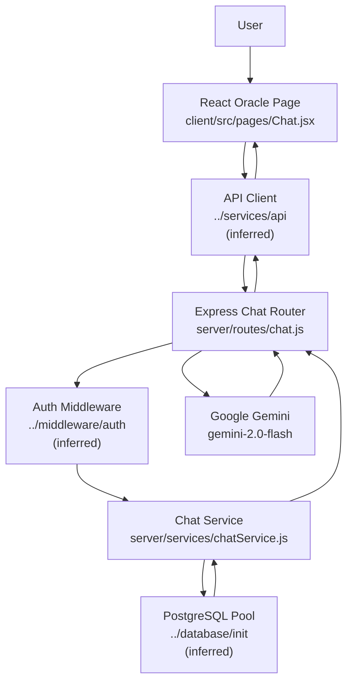
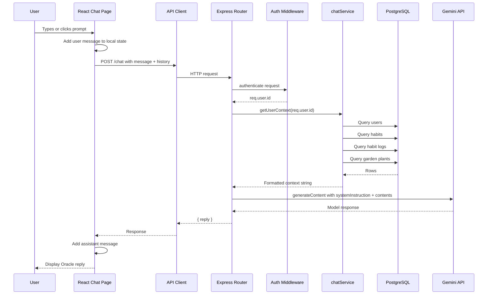
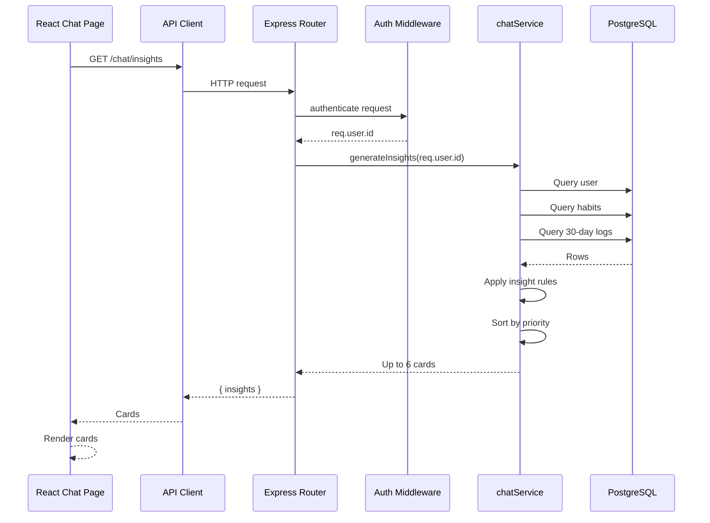
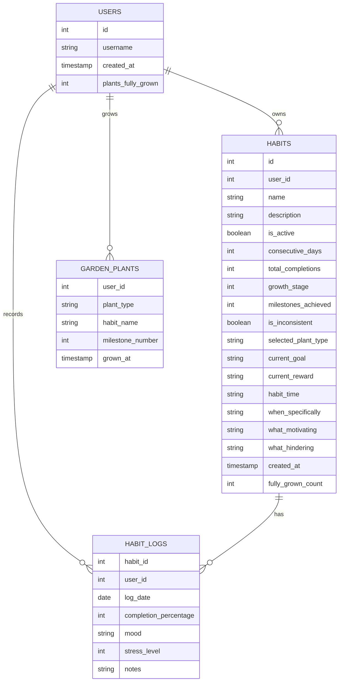
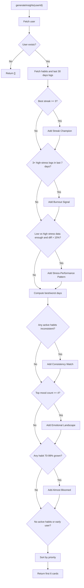
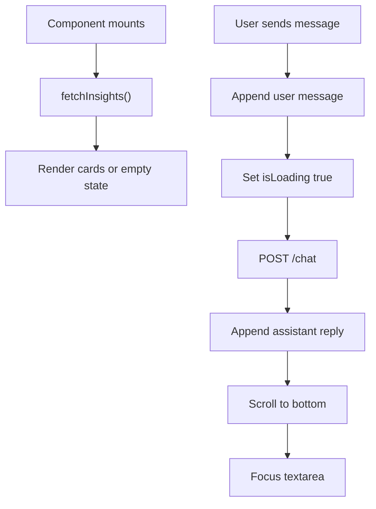
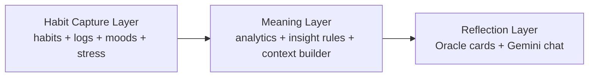
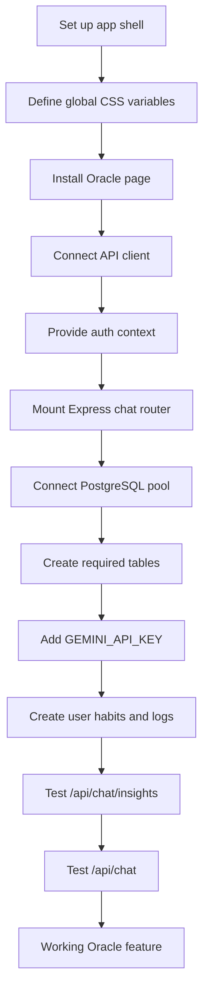

# RoutIQ Complete Project Guidebook

Version: source-code sweep of the local workspace on 2026-05-10  
Scope: `/Users/manasvisharma/Desktop/uni/sem-3 material/routiq-dbms-project`

## 0. How to Read This Guidebook

This document is intentionally not a pitch deck, not a summary, and not a small edited brochure. It is a technical and conceptual assembly manual for the RoutIQ project as represented by the local workspace.

There is one important scope note: the workspace currently contains only a focused slice of the full application:

- `client/src/pages/Chat.jsx`
- `client/src/pages/Chat.css`
- `server/routes/chat.js`
- `server/services/chatService.js`
- `ROUTIQ_GUIDEBOOK.pdf`

There is no `package.json`, no database initialization file, no auth middleware source, no global React app shell, no schema migration file, and no README in the visible workspace. The code does import modules that must exist in the larger project, such as `../database/init`, `../middleware/auth`, `../services/api`, and `../contexts/AuthContext`, but those files are not present here. Where this guide discusses those items, it marks them as inferred dependencies rather than directly inspected files.

This guidebook therefore has two layers:

1. Confirmed system behavior: what can be proven from the source files in this workspace.
2. Inferred architecture: what the missing application almost certainly contains because the visible slice depends on it.

The central confirmed feature is called **The Oracle**: an AI-powered habit reflection interface that uses a user's RoutIQ habit data to generate insight cards and conversational coaching.

---

## 1. Project Inventory

The project directory is small but meaningful. It contains a React page, a CSS module for that page, an Express router, a backend service layer, and an existing PDF guidebook artifact.

```text
routiq-dbms-project/
+-- ROUTIQ_GUIDEBOOK.pdf
+-- client/
|   +-- src/
|       +-- pages/
|           +-- Chat.css
|           +-- Chat.jsx
+-- server/
    +-- routes/
    |   +-- chat.js
    +-- services/
        +-- chatService.js
```

### File Roles

| File | Role |
| --- | --- |
| `client/src/pages/Chat.jsx` | React implementation of the Oracle page: insight cards, suggested prompts, chat conversation, message rendering, loading states, and API calls. |
| `client/src/pages/Chat.css` | Full visual styling for the Oracle page, including layout, cards, bubbles, dark mode, responsive behavior, typing animation, and botanical visual language. |
| `server/routes/chat.js` | Express API routes for Oracle chat and insight cards. Handles authentication, request validation, Gemini setup, system prompt composition, and error responses. |
| `server/services/chatService.js` | Data gathering and deterministic insight engine. Queries PostgreSQL habit tables, builds AI context text, computes user patterns, and returns insight-card objects. |
| `ROUTIQ_GUIDEBOOK.pdf` | Existing 8-page PDF artifact. It mentions a wider RoutIQ architecture, but most of those files are not available in the current workspace. |

---

## 2. What RoutIQ Is About

RoutIQ is a habit-tracking system with a botanical metaphor and a behavioral philosophy that avoids treating habits as simple yes/no checkboxes.

From the code, RoutIQ tracks:

- Users.
- Habits.
- Habit activity status.
- Streaks.
- Total completions.
- Growth stages.
- Milestones.
- Inconsistency flags.
- Plant types.
- Goals.
- Rewards.
- Habit timing.
- Motivations.
- Hindrances.
- Daily habit logs.
- Completion intensity.
- Mood.
- Stress level.
- Notes.
- Garden plants grown from habit milestones.

The major product idea is that a user's habits become an ecosystem. Habits are represented as growing plants, habit logs become nourishment, and long-term consistency becomes a garden collection. The Oracle sits on top of that ecosystem as a reflective intelligence layer.

The Oracle is not written as a generic chatbot. Its system prompt explicitly positions it as a personalized reflection companion. It is meant to analyze concrete user data and respond with calm, grounded, habit-specific advice.

### Product Philosophy

The project's philosophy can be summarized as:

- Habits are living systems, not binary tasks.
- Consistency should be interpreted through patterns, not shame.
- Partial progress matters.
- Stress and mood are first-class habit signals.
- The app should protect motivation instead of punishing imperfection.
- Reflection should be personal and data-grounded.
- Growth should be visual, gradual, and emotionally legible.

This philosophy appears in both the code and the user experience:

- The backend computes stress-completion correlations.
- The backend detects burnout signals.
- The Oracle prompt tells the model to prioritize self-compassion when stress is high.
- The frontend uses botanical styling, plant/growth terms, and gentle insight card language.
- The database context includes the user's own motivations and hindrances.

---

## 3. Confirmed Technology Stack

The code directly confirms the following stack:

| Layer | Technology | Evidence |
| --- | --- | --- |
| Frontend | React | `Chat.jsx` imports React hooks and exports a React component. |
| Frontend HTTP | Custom API client, likely Axios | `Chat.jsx` imports `api` from `../services/api`. |
| Frontend auth | React auth context | `Chat.jsx` imports `useAuth` from `../contexts/AuthContext`. |
| Frontend icons | `lucide-react` | Many Lucide icons are imported in `Chat.jsx`. |
| Frontend styling | Plain CSS with CSS variables | `Chat.css` uses variables like `--font-display`, `--forest-deep`, `--color-accent`. |
| Backend | Node.js and Express | `chat.js` imports Express and exports an Express router. |
| Backend database | PostgreSQL via a pool object | `chatService.js` imports `pool` from `../database/init` and uses SQL queries. |
| Backend auth | Middleware-based authentication | `chat.js` imports `authenticate` from `../middleware/auth`. |
| AI provider | Google Gemini | `chat.js` imports `GoogleGenerativeAI` from `@google/generative-ai`. |
| AI model | `gemini-2.0-flash` | Explicitly selected in `chat.js`. |
| Config | `dotenv` | `chat.js` calls `require('dotenv').config()`. |

The older PDF also mentions Vite, JWT, bcrypt, and serverless deployment. Those are plausible for the larger app, but in this local source slice only JWT-style authentication can be inferred from the existence of `authenticate`; bcrypt and Vite are not directly visible.

---

## 4. High-Level Architecture

RoutIQ's visible architecture is a classic React + Express + PostgreSQL + AI-service flow.



The frontend does two main things:

1. Fetches deterministic insight cards from `/chat/insights`.
2. Sends conversational messages to `/chat`, including previous conversation history.

The backend does two main things:

1. Builds a complete user habit context string from PostgreSQL.
2. Sends that context plus the conversation to Gemini.

There is also a separate deterministic insight generator that does not require Gemini. It calculates cards from raw habit data.

---

## 5. The Oracle Feature

The Oracle is the most important confirmed feature in this workspace.

It has two surfaces:

1. **Live Observations**: insight cards generated by deterministic backend rules.
2. **Reflect with the Oracle**: a chat interface backed by Gemini and grounded in user habit data.

### 5.1 User Experience

When the user opens the Oracle page:

1. The component initializes with empty messages.
2. A `useEffect` calls `fetchInsights()`.
3. The page displays a header with the Oracle identity.
4. It shows insight cards if available.
5. It shows an empty chat state with suggested prompts if no conversation has started.
6. The user can click a suggested prompt, click an insight card, or type a custom question.
7. The chat sends the message to the backend.
8. The backend returns Gemini's reply.
9. The reply is rendered as styled paragraphs and bullets.

### 5.2 Suggested Prompts

The frontend includes six predefined prompts:

- Why do I lose consistency?
- What habit complements my routine?
- When am I most productive?
- What patterns do you notice?
- Am I close to burnout?
- How can I improve my streaks?

These prompts are designed around the backend's available data:

- Consistency patterns.
- Habit relationships.
- Day-of-week productivity.
- Mood and stress patterns.
- Burnout risk.
- Streak improvement.

### 5.3 Insight Cards

Insight cards are backend-generated and returned from `GET /api/chat/insights` as objects containing:

```js
{
  type: "streak",
  iconName: "flame",
  title: "Streak Champion",
  body: "...",
  priority: "high"
}
```

The frontend maps `iconName` strings to Lucide icon components:

| `iconName` | Icon |
| --- | --- |
| `flame` | Flame |
| `alert-triangle` | AlertTriangle |
| `brain` | Brain |
| `calendar-check` | CalendarCheck |
| `moon` | Moon |
| `trending-down` | TrendingDown |
| `heart-pulse` | HeartPulse |
| `sprout` | Sprout |
| `leaf` | Leaf |
| `sunrise` | Sunrise |

If the server sends an unknown icon name, the frontend falls back to `Sparkles`.

Clicking an insight card sends:

```text
Tell me more about: <insight title>
```

That turns deterministic insight cards into conversational entry points.

---

## 6. Backend API Surface

The backend router in `server/routes/chat.js` defines two endpoints.

### 6.1 `POST /api/chat`

Purpose: Generate a personalized Oracle chat response.

Authentication: Required via `authenticate`.

Request body:

```json
{
  "message": "What patterns do you notice?",
  "history": [
    {
      "role": "user",
      "content": "Earlier question"
    },
    {
      "role": "assistant",
      "content": "Earlier Oracle reply"
    }
  ]
}
```

Validation:

- `message` must exist.
- `message` must be a string.
- `message.trim().length` must be greater than zero.

Environment requirement:

- `GEMINI_API_KEY` must be present.

Success response:

```json
{
  "reply": "Oracle response text"
}
```

Missing API key response:

```json
{
  "error": "AI service unavailable",
  "reply": "The Oracle is currently resting. Please configure the Gemini API key."
}
```

Failure response:

```json
{
  "error": "Failed to generate response",
  "reply": "The Oracle could not process your request. Please try again in a moment."
}
```

### 6.2 `GET /api/chat/insights`

Purpose: Return deterministic insight cards for the current authenticated user.

Authentication: Required via `authenticate`.

Success response:

```json
{
  "insights": []
}
```

Failure response:

```json
{
  "error": "Failed to generate insights",
  "insights": []
}
```

---

## 7. Backend Request Flow

### 7.1 Conversational Flow



### 7.2 Insight Flow



---

## 8. Database Model as Seen from Code

No schema file is present, but SQL queries in `chatService.js` reveal the fields the Oracle expects.

### 8.1 `users`

Used fields:

| Column | Purpose |
| --- | --- |
| `id` | User primary key. |
| `username` | Display name used in Oracle context. |
| `created_at` | Used to calculate membership duration. |
| `plants_fully_grown` | Lifetime count of fully grown plants. |

The existing PDF mentions additional columns like `email`, `password_hash`, `avatar`, and coaching settings. Those are not used by this Oracle slice.

### 8.2 `habits`

Used fields:

| Column | Purpose |
| --- | --- |
| `id` | Habit identifier. |
| `user_id` | Ownership link to user. |
| `name` | Habit name shown in context and insights. |
| `description` | Selected but not currently written into the context string. |
| `is_active` | Separates active habits from inactive/paused habits. |
| `consecutive_days` | Current streak. |
| `total_completions` | Lifetime completion count. |
| `growth_stage` | Current plant growth progress. |
| `milestones_achieved` | Number of growth milestones reached. |
| `is_inconsistent` | Flag used for consistency warning insights. |
| `selected_plant_type` | Plant identity used in Oracle context and milestone cards. |
| `current_goal` | User's stated target. |
| `current_reward` | Selected but not currently written into context. |
| `habit_time` | Scheduled time. |
| `when_specifically` | Selected but not currently written into context. |
| `what_motivating` | User's motivation, used in context. |
| `what_hindering` | User's hindrances, used in context. |
| `created_at` | Sorting and age reference. |
| `fully_grown_count` | Selected but not currently written into context. |

### 8.3 `habit_logs`

Used fields:

| Column | Purpose |
| --- | --- |
| `habit_id` | Links log to a habit. |
| `user_id` | Ensures logs belong to current user. |
| `log_date` | Date filtering and day-of-week analysis. |
| `completion_percentage` | Main completion intensity. Despite the name, code treats it as numeric levels where `> 0` means completed and `=== 3` means full completion. |
| `mood` | Mood distribution and emotional pattern insights. |
| `stress_level` | Average stress, burnout detection, and stress-completion correlation. |
| `notes` | Selected for chat context query but not currently written into the context string. |

### 8.4 `garden_plants`

Used fields:

| Column | Purpose |
| --- | --- |
| `plant_type` | Type of grown plant. |
| `habit_name` | Habit that produced the plant. |
| `milestone_number` | Milestone sequence. |
| `grown_at` | Sorting by most recent. |
| `user_id` | Ownership filter. |

### 8.5 ER Diagram



---

## 9. The Context Builder

The function `getUserContext(userId)` is the Oracle's data pipeline. It creates the information that Gemini sees before answering.

Its stages are:

1. Fetch user profile.
2. Calculate days since the user joined.
3. Fetch all habits for the user.
4. Split habits into active and inactive.
5. Fetch habit logs from the last 30 days.
6. Filter recent logs from the last 14 days for per-habit statistics.
7. Compute statistics for each active habit.
8. Compute mood distribution.
9. Compute day-of-week completion rates.
10. Compute stress-completion buckets.
11. Fetch garden plants.
12. Build a formatted text report.

### 9.1 Context Sections Sent to Gemini

The generated context string contains sections like:

```text
=== USER PROFILE ===
Username: ...
Member for: ... days
Plants fully grown (lifetime): ...
Garden collection: ... plants
Total log entries (last 30 days): ...

=== ACTIVE HABITS (...) ===
- Habit name
  Streak: ...
  Total completions: ...
  14-day completion rate: ...
  Growth stage: ..., Milestones: ...
  Plant: ...
  Flagged inconsistent: ...
  Current goal: ...
  Scheduled time: ...
  Motivation: ...
  Hindrances: ...
  Most common mood while logging: ...
  Avg stress while logging: ...

=== INACTIVE / PAUSED HABITS (...) ===
...

=== MOOD DISTRIBUTION (last 30 days) ===
...

=== DAY-OF-WEEK PATTERNS ===
...

=== STRESS-COMPLETION CORRELATION ===
...

=== GARDEN COLLECTION ===
...
```

This is a retrieval-augmented generation style pattern, though it is not vector search. The app retrieves structured user data from PostgreSQL, formats it into natural-language context, and gives it to Gemini as grounding information.

### 9.2 Per-Habit Statistics

For each active habit, the service calculates:

| Metric | Meaning |
| --- | --- |
| `loggedDays` | How many logs exist in the last 14 days. |
| `completions` | Number of recent logs where `completion_percentage > 0`. |
| `fullCompletions` | Number of recent logs where `completion_percentage === 3`. |
| `completionRate` | Rounded percent based on `completions / 14`, not `completions / loggedDays`. |
| `moods` | Mood values from recent logs. |
| `avgStress` | Average stress over recent logs with stress values. |
| `mostCommonMood` | Mode of the recent mood list. |

The use of `completions / 14` is significant. It means the metric is a true two-week consistency rate, not just a rate among days the user logged. If a user logs only 2 days and completes both, the completion rate is `14%`, not `100%`. That is stricter and more honest for habit consistency.

### 9.3 Day-of-Week Patterns

The service creates two arrays of length 7:

- `dayOfWeekLogs`
- `dayOfWeekCompletions`

For every log in the last 30 days:

1. It computes the day index using `new Date(l.log_date).getDay()`.
2. It increments the log count for that day.
3. It increments the completion count if completion is above zero.

The result is a list:

```js
[
  { day: "Sunday", rate: 75 },
  { day: "Monday", rate: null },
  ...
]
```

`null` means there was no data for that day.

### 9.4 Stress Buckets

Stress is bucketed into:

| Bucket | Rule |
| --- | --- |
| `low` | `stress_level <= 2` |
| `medium` | `stress_level <= 3` |
| `high` | `stress_level >= 4` |

Each bucket stores:

```js
{
  completed: 0,
  total: 0
}
```

This lets the Oracle say whether high-stress days are less consistent than low-stress days.

---

## 10. The Gemini Prompt

The system prompt in `server/routes/chat.js` defines the Oracle's identity.

### 10.1 Personality

The Oracle is instructed to be:

- Warm.
- Perceptive.
- Gently challenging.
- Calm.
- Botanical in tone.
- Grounded rather than corny.
- Personalized rather than generic.

It is explicitly forbidden from using emojis.

### 10.2 Capabilities

The prompt lists five capabilities:

1. Pattern recognition.
2. Personalized reflection.
3. Habit recommendations.
4. Burnout prevention.
5. Motivation anchoring.

These map directly to the available database context:

| Prompt capability | Data source |
| --- | --- |
| Pattern recognition | Logs, streaks, day-of-week rates, stress-completion buckets. |
| Personalized reflection | Habit names, goals, motivations, hindrances. |
| Habit recommendations | Existing habit set and completion patterns. |
| Burnout prevention | Recent stress levels and consistency drops. |
| Motivation anchoring | `what_motivating`, `current_goal`, habit history. |

### 10.3 Rules

The model is told to:

- Always ground responses in user data.
- Reference specific habit names, streaks, moods, and stress levels.
- Never invent data.
- Admit when data is insufficient.
- Keep replies concise.
- Recommend habits based on the user's current routine.
- Prioritize self-compassion during high stress and dropping consistency.
- Use markdown when helpful.
- End most replies with a reflective question.
- Never use emojis.

### 10.4 Gemini Call Shape

The backend builds a `contents` array from chat history and current message:

```js
contents.push({
  role: "user",
  parts: [{ text: message }]
});
```

For history:

- User messages become Gemini role `user`.
- Assistant messages become Gemini role `model`.

The full system prompt plus user context is sent as:

```js
systemInstruction: {
  role: "user",
  parts: [{ text: fullSystemPrompt }]
}
```

The selected model is:

```js
gemini-2.0-flash
```

---

## 11. Deterministic Insight Engine

The function `generateInsights(userId)` produces insight cards without calling Gemini.

This is a strong design choice. The app does not depend on AI for every piece of intelligence. Repetitive, measurable patterns are handled deterministically, making them faster, cheaper, and more predictable.

### 11.1 Insight Types

The engine can create the following insight types:

| Type | Trigger | Priority |
| --- | --- | --- |
| `streak` | Best active habit has streak of at least 3 days. | High if streak >= 7, else medium. |
| `burnout` | At least 3 logs in last 7 days have stress level 4 or 5. | High. |
| `pattern` | Low-stress and high-stress logs both have enough data, and low-stress completion is more than 15 percentage points higher. | Medium. |
| `timing` / Peak Day | A day has at least 2 logs and the best completion rate. | Low. |
| `timing` / Dip Day | A day has at least 2 logs and the worst completion rate, different from best day. | Low. |
| `consistency` | One or more active habits are flagged `is_inconsistent`. | Medium. |
| `emotional` | A mood appears at least 4 times in recent logs. | Medium. |
| `milestone` | An active habit has growth progress between 70% and 100%. | Medium. |
| `onboarding` | No active habits. | High. |
| `onboarding` / Early Days | User joined within 7 days and has 1-2 active habits. | Medium. |

After generation, insights are sorted by priority:

```js
const priorityOrder = { high: 0, medium: 1, low: 2 };
```

Then the service returns at most six:

```js
return insights.slice(0, 6);
```

### 11.2 Insight Decision Tree



### 11.3 Why Deterministic Insights Matter

The deterministic engine gives the app:

- Fast loading insight cards.
- Predictable output.
- No hallucinated measurements.
- Lower AI cost.
- Clear thresholds.
- Easier debugging.
- A stable bridge into AI chat.

The Oracle chat can interpret, expand, and personalize these insights, but the first detection pass is mathematical.

---

## 12. Frontend Architecture

The main frontend component is `Chat`.

### 12.1 Imports

The file imports:

- React hooks: `useState`, `useEffect`, `useRef`.
- `api` from `../services/api`.
- `useAuth` from `../contexts/AuthContext`.
- Many Lucide icons.
- `./Chat.css`.

### 12.2 State

The component maintains:

| State | Purpose |
| --- | --- |
| `messages` | Conversation history displayed on screen. |
| `input` | Current textarea content. |
| `isLoading` | Whether a chat message is being processed. |
| `insights` | Insight cards returned by backend. |
| `insightsLoading` | Whether cards are currently loading. |

It also uses refs:

| Ref | Purpose |
| --- | --- |
| `messagesEndRef` | Scroll target for keeping chat at bottom. |
| `inputRef` | Refocus input after sending. |

### 12.3 Lifecycle

There are two `useEffect` calls:

1. On mount, fetch insight cards.
2. Whenever messages change, scroll to bottom.



### 12.4 Message Sending

The `sendMessage` function:

1. Uses the passed text or current input.
2. Trims whitespace.
3. Stops if empty or already loading.
4. Creates a user message.
5. Adds the user message to state immediately.
6. Clears input.
7. Sets loading true.
8. Posts to `/chat`.
9. Sends the current message plus previous history.
10. Appends the assistant response.
11. On error, appends fallback response.
12. Clears loading.
13. Focuses input.

This gives the UI an optimistic feel because the user's message appears immediately.

### 12.5 Keyboard Behavior

The textarea uses:

- Enter to send.
- Shift+Enter to insert a newline.

That is standard chat behavior.

### 12.6 Message Rendering

Assistant messages go through `renderMessageContent(content)`.

The renderer:

- Splits content by newline.
- Converts `**bold**` to `<strong>`.
- Converts `*italic*` to `<em>`.
- Converts lines starting with `- ` or a bullet character into custom bullet rows.
- Renders blank lines as spacing.
- Renders other lines as paragraphs.

This is a lightweight markdown renderer, not a full markdown library.

Important implementation detail: it uses `dangerouslySetInnerHTML` after regex replacement. Because the content comes from an AI service, this creates an XSS risk if not sanitized. More on that in the risk section.

---

## 13. Frontend Visual Design

The Oracle page has a botanical, calm, premium habit-coaching aesthetic.

### 13.1 Layout

The page structure is:

```text
oracle-page page-shell
+-- page-width
    +-- oracle-header
    +-- insights-section
    |   +-- insights-header
    |   +-- insights-grid / loading / empty
    +-- chat-section
        +-- chat-header-bar
        +-- chat-container
            +-- chat-messages
            +-- chat-input-area
```

### 13.2 Visual Language

The design uses:

- Forest green gradients.
- Botanical names like `Leaf`, `Sprout`, `Flame`, `Sunrise`.
- Soft cards.
- Rounded chat bubbles.
- Gentle shadows.
- Light and dark mode mappings.
- Small uppercase eyebrow labels.
- A premium display font via `--font-display`.
- An accent font via `--font-accent`.

### 13.3 Insight Cards

Insight cards:

- Are placed in a responsive grid.
- Have priority-specific accents.
- Use hover lift.
- Reveal an "Explore" CTA on hover.
- Are clickable.
- Use icons to signal insight type.

Priority affects visual treatment:

| Priority | Visual behavior |
| --- | --- |
| High | Rosy bloom accent underline and icon treatment. |
| Medium | Moss/forest accent. |
| Low | Teal accent. |

### 13.4 Chat Bubbles

User messages:

- Align right.
- Use forest gradient.
- Use a user avatar with first username letter.

Oracle messages:

- Align left.
- Use bot avatar.
- Use subtle surface background.
- Support paragraphs and bullets.

Loading state:

- Shows an Oracle message bubble with animated typing dots.

### 13.5 Dark Mode

Dark mode is keyed on:

```css
body[data-theme='dark']
```

The CSS remaps:

- Header colors.
- Card title/body colors.
- Icon backgrounds.
- Chat bubble backgrounds.
- Prompt pill colors.
- Input area background.
- Shadows.

The design assumes the rest of the app defines root variables like:

- `--color-text-primary`
- `--color-text-secondary`
- `--color-text-muted`
- `--color-accent`
- `--surface-subtle`
- `--surface-subtle-strong`
- `--surface-chip`
- `--color-border`
- `--radius-lg`
- `--radius-xl`
- `--shadow-strong`
- `--font-display`
- `--font-sans`
- `--font-accent`

Those definitions are not present in this workspace, so they must live in a global stylesheet in the larger app.

### 13.6 Responsive Behavior

At widths under 720px:

- Header top padding shrinks.
- Insight grid becomes one column.
- Chat container has smaller minimum height.
- Chat max height is removed.
- Message padding is reduced.
- Chat messages can use up to 90% width.
- Suggested prompts can fill the available width.

---

## 14. Feature Map

### 14.1 Confirmed User-Facing Features

| Feature | Description |
| --- | --- |
| Oracle header | Introduces the AI companion as personalized intelligence. |
| Live observations | Shows deterministic insight cards generated from user data. |
| Clickable insight cards | Lets user ask the Oracle to expand on a card. |
| Suggested prompts | Gives users useful first questions. |
| AI chat | Allows free-form questions about habits. |
| Conversation history | Sends previous messages to Gemini for continuity. |
| Loading indicators | Shows insight loading and chat typing states. |
| Empty state | Encourages users to log habits if no insights exist. |
| Light/dark mode styling | Supports both themes via body attribute. |
| Responsive design | Works on mobile and desktop. |

### 14.2 Confirmed Backend Features

| Feature | Description |
| --- | --- |
| Auth-protected chat | Uses middleware before chat endpoints. |
| Gemini integration | Calls `gemini-2.0-flash`. |
| User context retrieval | Builds a profile from user, habit, log, and garden data. |
| Pattern analytics | Calculates completion rates, mood distributions, day-of-week rates, and stress correlations. |
| Insight generation | Returns up to six prioritized insight cards. |
| API-key fallback | Returns a friendly message if Gemini is not configured. |
| Error fallback | Returns stable fallback response on backend failure. |

---

## 15. Data Contracts

### 15.1 Chat Message Object

Frontend message object:

```js
{
  role: "user" | "assistant",
  content: "message text"
}
```

Backend converts this to Gemini's format:

```js
{
  role: "user" | "model",
  parts: [{ text: "message text" }]
}
```

### 15.2 Insight Object

```js
{
  type: "streak" | "burnout" | "pattern" | "timing" | "consistency" | "emotional" | "milestone" | "onboarding",
  iconName: "flame",
  title: "Streak Champion",
  body: "Text shown on card.",
  priority: "high" | "medium" | "low"
}
```

### 15.3 User Context String

The context passed to Gemini is plain text, not JSON. This makes it easy for a language model to read but harder for strict downstream validation.

Benefits:

- Human-readable.
- Prompt-friendly.
- Easy to debug in logs if needed.

Tradeoffs:

- Less structured than JSON.
- Harder to enforce exact grounding.
- Might become long as data grows.
- Requires careful prompt design.

---

## 16. Security and Privacy

### 16.1 Authentication

Both routes use `authenticate`, so the Oracle depends on an authenticated request and `req.user.id`.

The route never accepts a user ID from the client. That is good. It prevents users from asking for another user's Oracle data by changing request payloads.

### 16.2 SQL Safety

The backend uses parameterized queries:

```js
WHERE id = $1
```

with values passed separately:

```js
[userId]
```

This is the correct pattern for preventing SQL injection.

### 16.3 AI Data Exposure

The Oracle sends detailed user habit data to Gemini:

- Username.
- Membership duration.
- Habit names.
- Streaks.
- Goals.
- Motivations.
- Hindrances.
- Mood distribution.
- Stress levels.
- Garden information.

That is core to the feature, but it is also privacy-sensitive. Production use should make this clear in privacy terms and should avoid sending anything unnecessary.

### 16.4 Frontend Rendering Risk

The assistant message renderer uses `dangerouslySetInnerHTML`.

Because the content comes from Gemini, there is a potential HTML/script injection risk. React's `dangerouslySetInnerHTML` will render HTML tags. If the model outputs malicious HTML or if a prompt injection causes it to include unsafe markup, the browser may interpret it.

Safer options:

- Use a markdown renderer with sanitization.
- Escape all raw HTML before applying bold/italic formatting.
- Use React element construction instead of raw HTML strings.
- Use a sanitizer such as DOMPurify if available.

### 16.5 Prompt Injection Risk

Because user messages and prior history are sent to Gemini, users could ask the model to ignore system instructions. The system instruction should reduce this, but the app should assume prompt injection is possible.

The safest architecture is:

- Never let the AI perform privileged actions directly.
- Keep AI read-only unless future tools are heavily permissioned.
- Avoid showing hidden instructions back to the user.
- Sanitize rendered output.
- Log and monitor failures.

---

## 17. Reliability and Edge Cases

### 17.1 Missing Gemini Key

If `GEMINI_API_KEY` is missing, the chat endpoint returns HTTP 503 with a friendly fallback reply.

This is good developer ergonomics because the frontend can still display a meaningful message.

### 17.2 Missing User

In `getUserContext`, a missing user throws `User not found`, resulting in a 500 response.

In `generateInsights`, a missing user returns `[]`.

This is slightly inconsistent. A future cleanup could standardize behavior.

### 17.3 Empty Insights

If there are no insights, the frontend shows:

```text
Start logging habits to unlock personalized insights.
```

However, the backend already creates onboarding cards for no active habits if the user exists. An empty insight state would more likely happen on error, unusual data, or if the user exists with conditions that trigger no cards.

### 17.4 Completion Rate Semantics

The code names the field `completion_percentage`, but compares it to numeric values like `0` and `3`.

This suggests it is not a percentage in the usual 0-100 sense. It appears to be a 0-3 completion scale.

That naming could confuse future developers. Possible clearer names:

- `completion_level`
- `completion_score`
- `completion_intensity`

### 17.5 Date Handling

The service uses JavaScript date math:

```js
new Date(l.log_date).getDay()
```

Depending on how PostgreSQL dates are serialized and what timezone the server uses, day-of-week calculations can shift around midnight. A more robust version would calculate day of week in SQL or use a timezone-aware date library.

### 17.6 History Growth

The frontend sends all messages in local state as history, except the just-created current message. There is no visible cap.

For long conversations, this can:

- Increase token cost.
- Slow responses.
- Hit provider context limits.
- Send more user data than necessary.

A future version could send only the last N messages or summarize older context.

---

## 18. Missing Pieces in the Local Workspace

The visible Oracle feature depends on files that are absent from this directory.

### 18.1 Missing Backend Files

Expected but not present:

- `server/database/init.js`
- `server/middleware/auth.js`
- Server entry point such as `server/index.js` or `server/app.js`
- Package manifest for backend dependencies
- Database schema or migration files
- User routes
- Habit routes
- Auth routes

### 18.2 Missing Frontend Files

Expected but not present:

- `client/src/services/api.js`
- `client/src/contexts/AuthContext.jsx`
- App router
- Global CSS variables
- Theme handling
- Main entry point
- Package manifest

### 18.3 Missing Tests

No test files are visible. Useful tests would include:

- Unit tests for `generateInsights`.
- Unit tests for `buildContextString`.
- API route tests for missing message, missing API key, and service failure.
- Frontend tests for prompt clicks, insight loading, message send behavior, and error fallback.
- Security tests around AI-rendered markdown/HTML.

---

## 19. Development and Configuration

Because package manifests are missing, exact install/run commands cannot be verified from this workspace.

Based on imports, the backend likely requires:

```text
express
dotenv
@google/generative-ai
pg
```

The frontend likely requires:

```text
react
lucide-react
axios or another HTTP client
```

Required environment variable:

```text
GEMINI_API_KEY=<Google Gemini API key>
```

Required database:

- PostgreSQL database accessible from `../database/init`.
- A `pool` export from that module.
- Tables matching the fields listed in the database section.

Expected auth:

- `authenticate` middleware must verify a request token/session.
- It must attach a user object with `req.user.id`.

---

## 20. Operational Mental Model

RoutIQ can be understood as three layers:



The habit capture layer records behavior.  
The meaning layer turns behavior into patterns.  
The reflection layer turns patterns into guidance.

That distinction is central to the product:

- A normal habit app stores checkmarks.
- RoutIQ stores signals.
- The Oracle interprets those signals as a living behavioral system.

---

## 21. Design Philosophy in Practice

The code repeatedly chooses language and mechanics that reduce harshness.

Examples:

- "Burnout Signal Detected" does not shame the user. It recommends reducing difficulty.
- "Dip Day" suggests lighter routines or rest days.
- "Early Days" tells the user to focus on showing up, not perfection.
- The system prompt says to prioritize self-compassion when stress is high.
- The garden metaphor frames habits as growth, not compliance.

This makes RoutIQ closer to a reflective habit companion than a productivity dashboard.

The app's philosophy is not anti-discipline. It still tracks streaks, completions, and consistency. But it interprets those metrics through context:

- Stress matters.
- Mood matters.
- Motivation matters.
- Hindrances matter.
- Timing matters.
- Partial completion matters.

---

## 22. Strengths of the Current Implementation

1. **Good separation of concerns**  
   The frontend handles interaction and rendering. The route handles HTTP and AI provider orchestration. The service handles database queries and analytics.

2. **Deterministic insight cards**  
   Important patterns are calculated, not hallucinated.

3. **User-specific AI grounding**  
   The model receives habit names, streaks, stress, moods, goals, and motivations.

4. **Friendly fallbacks**  
   Missing Gemini keys and backend failures produce user-readable fallback messages.

5. **Clear product voice**  
   The prompt, UI copy, and CSS all support a consistent Oracle identity.

6. **Parameterized SQL**  
   Database queries use safe parameter binding.

7. **Good onboarding behavior**  
   New or empty users receive nudges rather than blank intelligence.

8. **Responsive UI**  
   Mobile behavior is considered.

9. **Dark mode support**  
   The Oracle styling supports both light and dark themes.

---

## 23. Risks and Improvement Areas

### 23.1 Sanitize AI Output

Highest-priority technical issue: assistant output is rendered with `dangerouslySetInnerHTML`.

Recommended fix:

- Replace custom regex + `dangerouslySetInnerHTML` with a safe markdown renderer.
- Or manually parse bold/italic into React elements without HTML injection.

### 23.2 Cap Conversation History

The frontend should avoid sending unlimited message history.

Recommended fix:

- Send last 8-12 messages.
- Add server-side truncation.
- Later, summarize older conversation turns.

### 23.3 Rename Completion Field

If `completion_percentage` is truly 0-3, the name is misleading.

Recommended fix:

- Rename to `completion_level` or document the scale clearly.

### 23.4 Add Tests for Insight Rules

`generateInsights` has many thresholds and edge cases. It should have unit tests.

Test cases should include:

- No user.
- No active habits.
- Early user.
- Streak 2 vs 3 vs 7.
- Burnout exactly 2 vs 3 high-stress logs.
- Stress-performance diff below and above 15.
- Best and worst day logic.
- Mood threshold exactly 3 vs 4.
- Growth progress 69%, 70%, 99%, 100%.

### 23.5 Timezone-Safe Date Logic

Day-of-week calculations should be made timezone-safe.

Possible fix:

- Compute day of week in PostgreSQL using a known timezone.
- Or normalize dates without timezone conversion.

### 23.6 Include Notes or Remove Them from Query

`notes` is selected from `habit_logs` in `getUserContext`, but not included in the final context.

Options:

- Add recent notes to the context if they are valuable.
- Remove them from the query if not needed.

### 23.7 Standardize Missing User Behavior

`getUserContext` throws; `generateInsights` returns empty array.

Recommended fix:

- Decide whether missing authenticated users should be 404, 401, or empty.
- Apply consistently.

---

## 24. Future Expansion Ideas

These are natural next steps based on the current architecture.

### 24.1 Richer Context Builder

Add:

- Recent notes summaries.
- Habit age.
- Missed-day streaks.
- Best time-of-day patterns.
- Goal-progress mismatch.
- Reward effectiveness.
- Hindrance recurrence.

### 24.2 More Insight Cards

Possible new insight types:

- "Quiet Comeback": consistency improving after a slump.
- "Fragile Streak": streak exists but stress is rising.
- "Motivation Mismatch": stated goal does not match completion pattern.
- "Best Companion Habit": two habits succeed on the same days.
- "Recovery Window": best rest day pattern.
- "Overloaded Routine": too many active habits with low completion.

### 24.3 Memory Layer

The older PDF mentions Oracle memories and vector-style storage, but this code does not implement it.

A future memory system could store:

- User reflections.
- Important self-insights.
- Repeated obstacles.
- AI-generated summaries.
- Preference signals.

However, memory should be transparent and editable because it affects user trust.

### 24.4 Admin/Debug View

A developer-facing Oracle debug view could show:

- Final context string.
- Generated insights.
- Model request payload.
- Token estimate.
- Last database query timing.
- Missing data warnings.

This would make AI behavior easier to debug.

---

## 25. Assembly Manual: How the Pieces Fit

If you were assembling RoutIQ from this slice, the minimum required system would look like this:

1. Create a React app with routing.
2. Define global CSS variables and themes.
3. Add `Chat.jsx` as a page.
4. Add `Chat.css`.
5. Create an API client that prefixes requests with `/api` and sends auth credentials.
6. Create an auth context that exposes `user.username`.
7. Create an Express server.
8. Mount `server/routes/chat.js` at `/api/chat`.
9. Implement `authenticate` middleware that sets `req.user.id`.
10. Implement `database/init.js` that exports a PostgreSQL `pool`.
11. Create PostgreSQL tables for users, habits, habit logs, and garden plants.
12. Provide `GEMINI_API_KEY`.
13. Start the frontend and backend.
14. Log habits for a user.
15. Visit the Oracle page.
16. Confirm insight cards appear.
17. Ask a question.
18. Confirm Gemini responds using habit-specific context.



---

## 26. Glossary

| Term | Meaning |
| --- | --- |
| Oracle | RoutIQ's AI reflection companion. |
| Insight card | Deterministic observation generated from user habit data. |
| Completion percentage | In code, appears to mean a 0-3 completion intensity level. |
| Growth stage | Numeric plant progress for a habit. |
| Milestone | A growth achievement tied to a habit. |
| Garden collection | Historical plants grown through habit milestones. |
| Inconsistent habit | Active habit flagged by the system as inconsistent. |
| Stress-completion correlation | Relationship between stress bucket and completion rate. |
| Mood distribution | Count of logged moods over the last 30 days. |
| Context builder | Backend process that formats database facts for Gemini. |
| RAG-like grounding | Supplying retrieved user data to a generative model. This implementation uses SQL retrieval, not vector retrieval. |

---

## 27. Final Mental Model

RoutIQ is best understood as a habit ecosystem with an intelligence layer.

At the bottom, it records behavior: habits, logs, completion levels, moods, stress, streaks, and growth.  
In the middle, it computes meaning: rates, patterns, emotional landscapes, burnout warnings, and milestone proximity.  
At the top, it reflects that meaning back to the user through the Oracle: a calm AI companion that turns raw habit data into personal guidance.

The current workspace is not the whole product. It is the Oracle module and its supporting analytics layer. But that module reveals the project's core identity clearly: RoutIQ is not trying to be a checkbox app. It is trying to be a reflective growth system where data is used not only to measure the user, but to help the user understand themselves.
